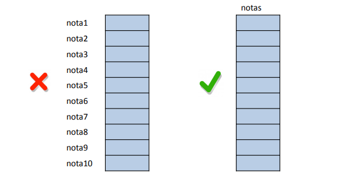

# C
## Panorama histórico
A linguagem C surge em 1972 nos laboratórios da Bell, sendo que a mesma foi projetada para ser uma linguagem de propósito geral.

A lingaugem foi padronizada pela ISO, pois um grande número de implementações e compiladores foram criados.

C é uma das linguagens mais importante, pois ajudou na contrução de milhares de softwares, além de inspirar a criação de outras linguagens de programação

## Características
- É uma linguagem imperativa: baseada em comandos e dados;
- Uma linguagem estruturada: os programas são baseados em sequências de comandos e decisões;
- Compilada: um compilador é utilizado para gerar programas executáveis

### Compilador
O compilador é um software básico da computação que tem por objetivo ler um programa escrito em uma linguagem fonte e gerar um programa equivalente em uma linguagem alvo.

O programas em C são arquivos com extensão `.c`. A compilação dele gera um executável `.exe`. 

Para compilarmos os programas gerados usamos compiladores, algum deles são:
- GCC
- Clang
- IBM

## Tipos de dados
|Tipos                   |Palavra chave         |
|------------------------|----------------------|          
| caracterere            | char                 |
| inteiro                | int                  |
| real (precisão simples)| float                |
| real (precisão dupla)  | double               |
| void                   | void                 |             

### Modificadores

|Modificador             |Descrição         |
|------------------------|------------------|          
| signed            	 | char             |
| unsigned               | int              |
| long 					 | float            |
| short   				 | double           |

### Operadores aritiméticos

|Operador      |Operação        |
|--------------|----------------|          
| -            | troca de sinal |
| -            | subtração      |
| +            | soma           |
| *            | multiplicação  |
| /            | divisão        |
| %            | módulo         |
| ++           | incremento     |
| --           | decremento     |

## Programas Sequenciais
Abaixo um programa sequencial em **C** com o uso de dados apresentados acima e com entrada e saída de dados.
```C
#include <stdio.h>

void main () {
	int a, b, soma;
	printf("Digite o primeiro numero: "); // Saida de dados
	scanf("%d", &a) // Leitura e armazenamento do dado

	printf("Digite o segundo numero: ")
	scanf("%d", &b);

	soma = a + b;

	printf("A soma de %d e %d e igual a %d", a, b, soma);
}
```

## Comandos condicionais
### Operadores relacionais

|Operador      |Descrição       |
|--------------|----------------|          
| >,>=,<,<=>   | comparação     |
| ==           | igualdade      |
| !=           | diferença      |

### Operadores lógicos

|Operador      |Operador        |
|--------------|----------------|          
| !            | negação        |
| &&           | AND            |
| \|\|         | OR             |

*Obs:* A ordem de precedência dos operadores é negação, E e OU.

### if (se)

Em uma condição com <code>if</code> a "resposta" será uma valor lógico (true ou false)

```C
if (condicao) comando;

if (condicao) {
	lista de comando
}
```

Um exemplo seria um programa que ler um valor inteiro e informa se o número é positivo:

```C
#include <stdio.h>

void main () {
	int dado;

	printf("Informe um valor inteiro: ");
	scanf("%d", &dado);

	if (dado > 0) // caso seja uma valor logico verdadeiro executa o bloco abaixo
		printf("\nE positivo");
}
```

### if-else (se-senao)

```C
if (condicao) comando;
else comando;

if (condicao) {
	lista de comando;
} else {
	lista de comando
}
```

Um exemplo de uso seria o comando a seguir:
-Um programa para ler a nota final e a frequência de um aluno e informar se ele foi aprovado ou reprovado. Para ser aprovado, o aluno deve ter a nota maior ou igual a 60 e a frequência maior ou igual a 75. Caso contrário, o aluno é reprovado.

```C
#include <stdio.h>

void main(){
	float nota, freq;

	printf("Digite a nota do aluno: ");
	scanf("%f", &nota);

	printf("\nDigite a frequencia do aluno: ");
	scanf("%f", &freq);

	if ( nota >= 60 && freq >= 75)
		printf("\nFoi aprovado.");
	else
		printf("\nNao foi aprovado.");
}

```

### switch-case
Quando se é necessário verificar o valor de uma variável **inteira** ou **caractere** é igual a um conjunto conhecido e finito de
valores, pode-se utilizar o comando <code>switch-case</code>.

O comando switch-case corresponde a uma sequência de comandos do tipo <code>if-else</code>


A vantagem de usá-lo em vez do <code>if-else</code> é que torna o código mais legível. A sua sintaxe é:

```C
switch (expressao) {
	case expressao: comandos;
		break; // necessário para que as demais clausulas nao sejam executadas também
	case expressao: comandos;
		break;
	default: comandos // caso nenhuma das outras cláusulas seja verdadeira
}
```

## Comandos de repetição
Uma repetição (ou loop, ou iteração, ou laço) é um sequência de passos executadas repetidas vezes até que uma determinada condição de parada ocorra.

Em <code>C</code>, há três tipos de comandos de repetição:
- do-while
- while
- for

### do-while
A sintaxe do <code>do-while</code> é:
```C
do 
	comando;
while (condicao);

do {
	lista de comandos;
} while (condicao); // Resulta em um valor lógico (true ou false)
```

Exemplo: um programa para ler o raio de círculos e informar a área deles. O programa deverá ser encerrado quando o usuário informar que não deseja continuar

```C
#include <stdio.h>
#include <math.h>

void main () {
	float raio, area;
	char resp;

	do {
		system("cls"); // limpar a tela no windows

		printf("\nDigite o raio: ");
		scanf("%f", &raio);

		if (raio > 0) {
			area = M_PI * pow(raio, 2);
			printf("\nA área é: %.2f", area);
		}
		else printf("\nRaio invalido");

		printf("\nDesejea continuar: (S/N): ");
		sflush(stdin);
		scanf("%c", &resp);
		
	} while (resp == 'S' | resp == 's');
}
```

### while
A sintaxe do <code>while</code> é:
```C
while (condicao) // Resulta em um valor lógico (true ou false)
	comando;

while (condicao) {
	lista de comandos;
} 
```

Obeseve que no comando **do-while**, o teste é realizado ao final, ou seja, os comandos são executados pelo menos uma vez.

Por sua vez, no comando **while**, o teste é realizado no início.

Exemplo: um programa para ler um sequência de números inteiros e positivos da entrada. O último número a ser informado deverá ser menor ou igual a zero. O programa deverá mostrar a soma dos números, a quantidade de números digitados e a média deles. 
```C
#include <stdio.h>

void main () {
	int numero, soma = 0, contador = 0;
	float media;

	printf("\nInforme o número para teste: ");
	scanf("%d", &numero);

	while ( numero > 0) {
		contador++; // contador = contador + 1
		soma += numero // soma = soma + numero

		printf("\nInforme o número para teste: ");
		scanf("%d", &numero);
	}

	if ( contador > 0) {
		media = float(soma) / contador;
		printf("\nA soma dos números é: %d", soma);
		printf("\nA quantidade de números válidos é: %d", contador);
		printf("\nA media dos números é: %.2f", media);
	}
}
```

### for
Quando se sabe previamente a quantidade de vezes que a repetição será realizada, pode-se usar um comando com a estrutura do tipo **para-cada**. Em **C** o comando <code>for</code> tem essa estrutura.

A sintaxe desse comando é a seguinte:
```C
for (comando_inicio; expressao; comando_fim)
	comando;

for (comando_inicio; expressao; comando_fim) {
	lista de comandos
}
```

comando-inicio:
 - é o comando realizado na entrada do bloco for;
 - em geral, ele é utilizado para definir o valor inicial de uma variável de controle do laço (um contador)


expressão: 
- é a condição que deve ser satisfeita para a repetição continuar

comando-fim:
- é o comando realizado na saída do bloco, antes da expressão ser avaliada;
- em geral, ele é utilizado para incrementar/decrementar a variável de controle do laço

Exemplo: Um programa para calcular o fatorial de um número. O fatorial é definido para os números inteiros maiores ou igual a zero da seguinte forma:
- Fatorial de 0 (0!) é igual a 1.
- Fatorial de N (N!) é dado por: N x Fatorial de N-1

```C 
#include <stdio.h>

void main () {
	unsigned long fat = 1;
	int num, i;

	printf("Digite um número: ");
	scanf("%d", &num);

	if ( num < 0 )
		printf("Não existe fatorial para o número");
	else if (num == 0 || num == 1)
		printf("Fatorial de %d e %d", num, 1);
	else {
		// calculo do fatorial
		for (i = 2; i < num; i++)
			fat *= i; // fat = fat * i;

		printf("Fatorial de %d é %d", num, fat);
	}
}
```

## Vetores
Um vetor é um tipo de dado que representa um conjunto de dados do mesmo tipo e referenciados por um só nome.




### Declaração
- tipo nome[tamanho];

```C
float notas[10];
char nome[100];
int idade[25];
```

### Acesso aos elementos
Os elementos de um vetor são indexados a partir de 0 até N-1 (N é o tamanho do vetor):
- nome[posicao]

```C
soma = nota[0] + nota[6];
```

### Inicialização
Caso os valores do vetores já sejam conhecidos, ele pode ser inicializado com a seguinte sintaxe
- tipo nome[tamanho] = { valores };

*obs:* os valores são separados por virgula (,)

```C
int idade[5] = {0, 1, 2, 3, 4};
```

A inicialização dos vetores pode também omitir o tamanho do vetor
- tipo nome[] = { valores };

```C
int diasMes[] = {31, 28, 31, 30, 31, 30, 31, 31, 30, 31, 30, 31};
```

*Obs: é util aplicar uma variável para armazenar o índice do vetor*

Exemplo: um programa para ler as idades de 10 pessoas e imprimir a maior unidade

```C
#include <stdio.h>

void main () {
	int idade[10], maior = 0;
	int i;

	for (i = 0; i < 10; i++) {
		printf("\nDifite a idade: ");
		scanf("%d", &idade[i]);
	}

	maior = idade[0];

	for (i = 1; i < 10; i++) 
		if (idade[i] > maior) maior = idade[i];

	printf("\nA maior idade e %d", maior);
}
```

#### CUIDADOS AO USAR VETOR
Ao utilizar vetores é necessário assegurar que o programa não acessará uma área de memória fora dos limites do vetor. A linguagem C não faz verificação em tempo de compilação.
Portanto essa situação é um erro de lógica que gera um erro em tempo de execução.

## Comandos e recursos em C
### Atribuição Composta

| Operador     | Operação                    | Exemplo| Equivalência|
|--------------|-----------------------------|--------|-------------|          
| +=           | Atribuição com soma         | a += b | a = a + b   |
| -=           | Atribuição com subtração    | a -= b | a = a - b   |
| *=           | Atribuição com multiplicação| a *= b | a = a * b   |
| /=           | Atribuição com divisão      | a /= b | a = a / b   |
| %=           |Atribuição com resto da divisão inteira| a %= b | a = a % b |

### Atribuição a mais de uma variável

A linguagem C possui um recurso que permite com que um valor resultante seja atribuido a mais de uma variável com somente um comando, segundo a seguinte sintaxe

```C
tipo var1 = var2 = var3 = expressao
```

Sendo que a ordem de execução de atribuição ocorre da direita para a esquerda.

### Definição de constantes

Uma forma de se definir constantes é utilizar a palavra diretiva do pré-processador **#define**. Usar a diretiva define informa ao pré-processador que deverá substituir a ocorrencia da palavra defina pela constante informa. Exemplo:

```C
#define TAM 10
```

Uma outra forma de se declara constante é utilizando a palavra **const**. Neste caso, uma posição de memória será reservada em tempo de execução, porém o seu valor não poderá ser altera depois. Exemplo:

```C
const float TAXA = 10;
```

### Conversão de dados e *cast*

Conversão é um tipo de operação que o compilador realiza para converter um tipo de dado (ex: tratar um numero inteiro como real). Há tipos de conversões que são feitas implicitamente, ou seja, nenhum comando é necessário. Porém existem casos que demandam o uso de comando explicitamente.

Exemplo:
 -  Se um dos operandos de um expressão aritmética for float, o outro operando
é convertido para float e o resultado da operação é um float (implicita)
 - float (a/b)

### Comandos break e continue

O comando **break** é utilizado em um loop para força o seu encerramento, ou seja, o loop se encerra imediatamente e a próxima intrução é executada.

```C
for(i=0; i<TAM; i++)
 if (vet[i] == val) break;
```

O comando **continue** por sua vez faz com que o fluxo de execução do programa seja desviado para o inicio do loop imediatamente. Exemplo: 

```C
while( (ch=getchar()) != '.' ){
 if (ch >= '0' && ch <= '9') continue;
 printf("%c", ch);
}
```

#### Loop infinito

O loop infinito ocorre quando a condição de parada do mesmo nunca é alcançada. Isso pode acontecer devido a um erro de lógica, ou porque o programador estabeleceu um loop infinito, já que a linguagem permite, embora não seja recomendado o seu uso.

No segundo caso seria necessario o uso do comendo **break** no corpo do loop

### String

Uma string é uma cadeia de caracteres. Em C, uma string é definida como um vetor de caracteres (Ex: char nome[50]).

#### Inicialização

Podemos iniciar uma string de duas formas:

```C
char nome[50] = "Maria";
char nome[50] = {'M','A','R','I','A'};
```

Vale ressaltar que em C o final de uma string é marcada com o caractere **'\0'**

#### Leitura

A leitura pode ser feita utilizando duas função, *scanf* e *gets*. Exemplo de uso:

```C
char str[50];
printf("Digite uma string: ");
scanf("%s",str);

char str[50];
printf("Digite uma string: ");
gets(str); // Para utilizar o gets é necessário incluir a biblioteca conio.h
```

#### string.h

A biblioteca <code>string.h</code> possui funções úteis para a manipulação de strings, dentre elas: 

#### strlen
Retorna a quantidade de caracteres contidos na string

#### strcat
Concatena a str1 e str2 e armazena o resultado na string str1

#### strncat
Concatena os primeiros n caracteres da str1 e str2 e armazena o resultado na string str1


#### strcpy
Copia a string str2 para a string str1. Caso str2 seja maior que str1, pode acontecer um erro em tempo de execução.

#### strncpy
Copia os n primeiros caracteres da string str2 para a string str1. Caso str2 seja maior que str1, pode acontecer um erro em tempo de execução.

#### strcmp
Compara str1 com str2 lexicograficamente e devolve:
 - valor negativo, caso str1 seja menor do que str2;
 - zero, caso str1 seja igual a str2;
 - valor positivo, caso str1 seja maior do que str2.

#### strncmp
Compara str1 com str2 lexicograficamente, considerando os n primeiros caracteres das strings e devolve:
 - valor negativo, caso str1 seja menor do que str2;
 - zero, caso str1 seja igual a str2;
 - valor positivo, caso str1 seja maior do que str2.

## Matrizes

Uma matriz é um conjunto de dados do mesmo tipo, referenciados por um nome. Uma matriz pode ter de uma a várias dimensões (um vetor é uma matriz de uma dimensão - unidimensional).
Em uma matriz bidimensional, por exemplo, são necessários dois índices para referenciar os seus elementos: o índice da linha e o da coluna.

### Declaração

Quando se conhece as dimensões das matrizes podemos declará-la com a seguinte sintaxe:

```C
 tipo nome[linhas][colunas] // linhas e colunas se referem quantidade de cada dimensão
```
### Acesso

Para se referenciar um determinado elemento de uma matriz utiliza-se a seguinte sintaxe:

```C
 nome[linha][coluna];
 notas[0][3] = 10.0;
 val = notas[6][4];
```

É útil também utilizarmos variáveis para armazenar os índices de um elemento de uma matriz. Exemplo:

```C
 float notas[linha][coluna];
 for (int i = 0; i < linha; i++) {
	for (int j = 0; j < colunas; j++) {
		notas[i][j] = 10;
	}
 }
```

### Inicialização

Podemos inicializar uma matriz de algumas formas diferentes, uma forma é como mostrado no exemplo acima, utilizando um <code>for</code>, a outra forma é a seguinte:

```C
 tipo nome[linha][coluna] = {{valores}, {valores}};
 int matriz[4][3] = {{0,0,0}, {1,1,1}, {2,2,2}, {3,3,3}};
```

## Função

Um programa que é escrito sem *subdivisões* se torna mais difícil de ler e de se realizar manutenções. Em um programa essas subdivisões são chamadas de **funções**.

Uma função é uma parte do código que realiza um tarefa específica, e essa tarefa só é executada quando uma outra parte do programa a chama. Quando essa tarefa é finalização a função retorna a execução para o ponto do programa que a chamou.

Até o momento o usando somente funções implementadas na biblioteca da linguagem C (printf, scanf, getchar, etc.). Um programa pode ter quantas funções forem necessárias.

*OBS: toda programa em C se inicia pela função **main** que invoca outras funções*

### Forma de uma função

A estrutura de uma função segue uma determinada forma:

```C
tipo_do_retorno nome_funcao( parametros ) {
	corpo_funcao
}
```

Aonde o *tipo_do_retorno* indica o tipo de dado que a função irá retornar como resultado, o *no_funcao* precisa ser um nome significativo que represente a tarefa da função. Os *parametros* são as listas de dados (separados por ;) que serão passados para a função realizar sua função. No *corpo_funcao* temos os comandos que definem a executação da função (desde de loops a variaveis locais)

Existe uma situação ondem um função executará um tarefas mas não retornará um valor ao final, nesse caso temos a função do tipo **void** que indica a ausencia de valor a ser retornado

### Parametros e Argumentos

Quando uma função é declarada é necessária informa os parâmetros que ela irá receber para poder executar sua tarefa, e também o tipo de dado que ela retornará. Exemplo:

```C
double pow(double base, double expoente) // funcao recebe dois parametros do tipo double e retorna um valor do tipo double
``` 

Quando uma função é usada em um programa dizemos que ela está sendo **chamada**. E ao chamarmos ela, precisamos passar os dados que ela espera. Nessa chamada os dados que passamos para ela são chamados de **argumentos**. Exemplo:

```C
result = pow(2,i); // pow é chamada recebendo dois argumentos (2 e i) e retorna um valor resultante que será armazenado variável result
```

### Retorno de uma função

Quando uma função termina de executar a sua tarefa, a função pode retornar um resultado para quem a chamou. Para isso acontecer é necessário utilizar o comando **return**.

Quando o return é executado, ele retorna o fluxo de execução para o ponto seguinte de onde a função foi chamada.

Esse return precisa ser deve ser seguido com uma expressão que indica o valor a ser retornado. Exemplo:
	- return x;
	- return a + b;
	- return -1;

Há o caso da função void, que não tem valor a ser retornado. Nesse caso:
	- O comando return não é necessário;
	- Se for utilizado, o comando não deve ser seguido de expressão (return ;).

## Adendo

- Pré-pocessador: parte do sistema de processamento de linguagem de C que prepara o arquivo para ser compilado
- Diretiva: instrução ao pré-processador sobre algo que deve realizar no programa a ser compilado
- Operador ternário: exp1? exp2 : exp3.